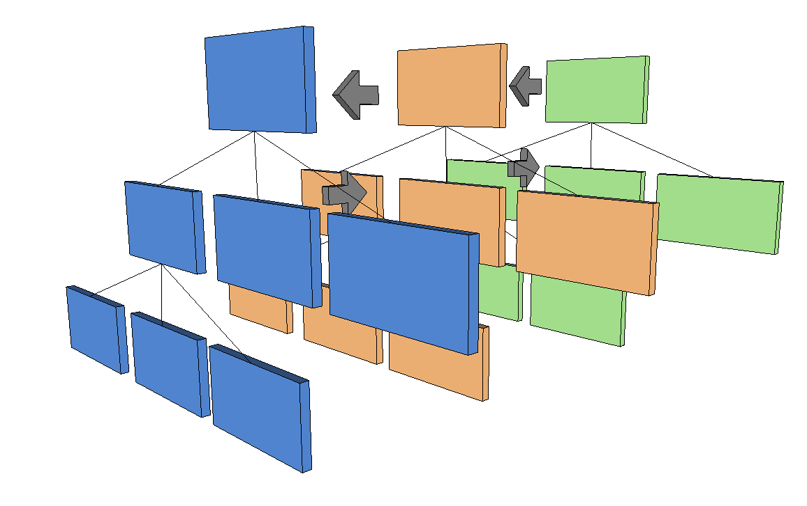

# Platform Overview

Xirsys WebRTC is based on a more general platform. Although the main focus of Xirsys is WebRTC, the platform is capable of supporting multiple services in a consistent way.

## KV4

Consistency is derived from KV4, a 4 dimensional K\/V Store. KV4 provides a scalable, distributed means of storing values \(json objects\) indexed by path, layer and key, with the added attribute of time-series.

To maintain compatibility with previous version of Xirsys we index into the store primarily by "path", a typical file system URI. We then add a second means of indexing by layer, best visualized as a second tree layered on the first.

Any intersection of path\/layer provides a hashtable which you may store "infinite" k\/vs.

Further, each value deposited at a given path\/key\/layer will not be overwritten but added to, providing a time series. Any casual query always retrieves the latest value, but you may retrieve the entire time series.

More information on the implementation of KV4 [here](/kv4.md).

## Services

Given the KV4 model, how does Xirsys allow services to add data for their configuration and operation?

Simply by allowing each service to create their own layers. For example:

* The turn service is designated by the layer name \*turn.
* The namespace service \(public tree\) stores it's data in the \*ns layer.
* The accounts service stores data in the \*acc layer.

Each service can effectively create it's own set of paths to data, they are not restricted to system specified paths. For example, the namespace service provides user defined paths, whereas the account service provides a \/accounts path - it's up to each service to partition it's own data.

Crucial to all potential services is scaling. If we get a consistent data model scaling over an arbitrary number of nodes, then we have the ability to scale the producers of arbitrary data \(services\) over those nodes too - the solution to this problem is the Xirsys platforms secret sauce.

### Built-in Services

Currently the following internal services are recognized:

* Accounts
* Namespace
* Discovery
* Sessions
* Configuration
* Subscriptions
* Statistics

### External Services

Currently the following external services are recognized:

* Turn

## API Consistency

Because data for all services is handled in a consistent manner, then the API to all the data may be accessed consistently too.

The API to all data is "restful" in that you may POST\/PUT\/GET\/DELETE to any service, via the following template.

```
curl http://un:pw@domain/_service/recognised/path
```

Remember the layer name is the service name. Thus if you want to query an account with key "ritchie"

```
curl http://un:pw@domain/_acc/accounts?k=ritchie
```

The same goes for external services.

If I want to create a new turn session i would PUT to the turn service,

```
curl -X PUT http://un:pw@domain/_turn/path/to/room -d {some json data}
```

Why is this external? External services are not part of what is known as the VSL, the Virtual System Layer \(an Erlang node\). The curl command is proxied through a VSL to a known node that provides the service, in this case turn.

A VSL contains logic for returning the least loaded existing external service or to start up the service if necessary by launching new service nodes.

Please see full API documentation [here](/http_api.md).

## Virtual System Layer

A VSL is an Elixir\/Erlang node and is the base runtime which knows how to talk to all other VSL nodes in a cluster.

The Xirsys platform provides multiple VSL per regional cluster.

Each VSL is a complete running system, that is, as long as 1 VSL is running it can deliver all baseline services and the API to access those services.

The baseline services offered by the current VSL are:

1. KV4 Access
2. Websockets
3. HTTP API
4. Dashboard
5. Node Bus - Pubsub between VSLs as they come on\/off line. VSLs know about each other.
6. High level abstractions for Accounts, Sessions, Configurations, Logging, Subscriptions.

Other services, e.g. turn, are treated as external services.

See VSL docs [here](/vsl.md).

